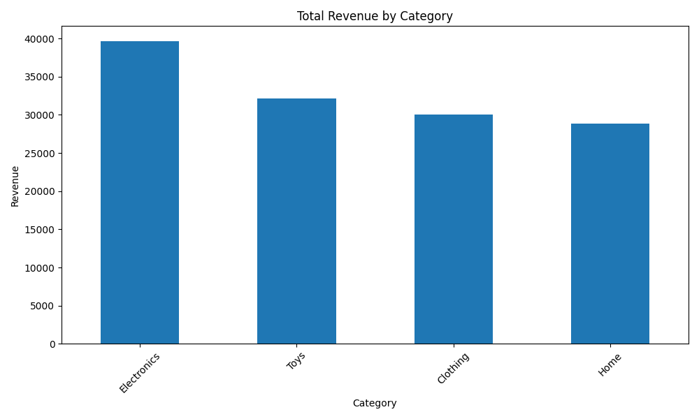

# Sales Analysis Report

## Overview
This report provides a detailed analysis of the sales data, including category-wise performance, monthly trends, and statistical summaries. The results are supported by visualizations.

---

## 1. Total Revenue by Category
Each category's total revenue and units sold are summarized below:

| Category       | Total Units Sold | Total Revenue |
|----------------|------------------|---------------|
| Electronics    | 3763             | 39,639.92     |
| Toys           | 3144             | 32,121.42     |
| Clothing       | 2884             | 30,007.57     |
| Home           | 2780             | 28,891.12     |

### Visualization

---

## 2. Monthly Sales and Revenue Trends
The monthly sales trends show how the units sold and revenue varied throughout the year.

| Month          | Total Units Sold | Total Revenue |
|----------------|------------------|---------------|
| 2022-01        | 681              | 6,780.74      |
| 2022-02        | 1022             | 11,613.12     |
| ...            | ...              | ...           |
| 2022-12        | 1118             | 12,413.18     |

---

## 4. Category-Wise Statistical Summary
The table below shows the average units sold and revenue for each category:

| Category       | Average Units Sold | Average Revenue |
|----------------|---------------------|-----------------|
| Toys           | 27.34              | 279.32          |
| Electronics    | 24.92              | 262.52          |
| Clothing       | 24.86              | 258.69          |
| Home           | 23.56              | 244.84          |

---
